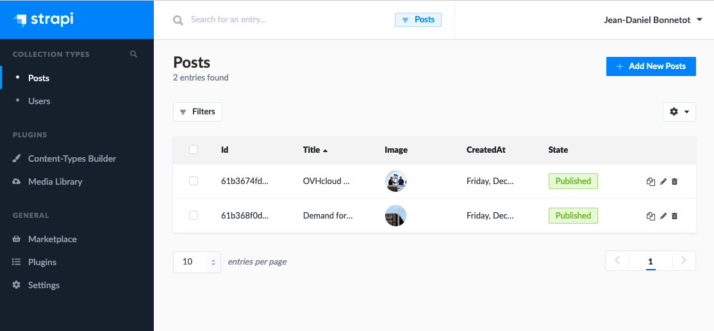
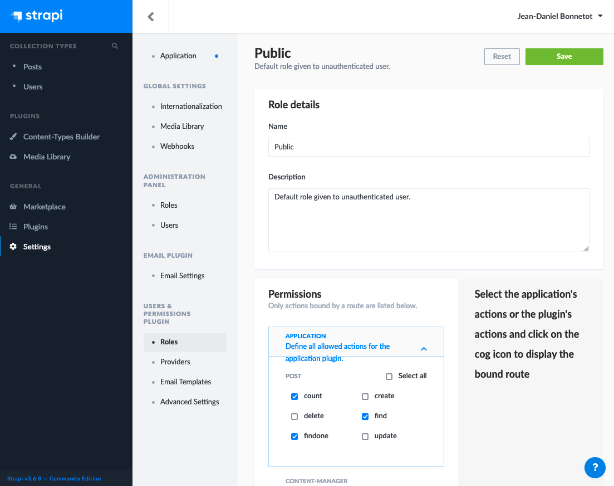

# demo-modernize-nodejs

This is a tutorial to deploy manually this strapi application demo. The deployment is based on an Unbuntu 20.04. It illustrate a standalone deployment mixing every part of the global application in one single server. 

In case of lack of power, we'll have to add more CPU and RAM. To avoid down time, a good practice should be to replicate the server and add synchronisation mechanism for the data (the statefull part), to use floating IP and to manage a master/slave system to switch IP in case of issue.

We won't cover the verticale sacling and the HA part here.

# Install a local DB

First we need to install MongoDB.

```bash
wget -qO - https://www.mongodb.org/static/pgp/server-5.0.asc | sudo apt-key add -
echo "deb [ arch=amd64,arm64 ] https://repo.mongodb.org/apt/ubuntu focal/mongodb-org/5.0 multiverse" | sudo tee /etc/apt/sources.list.d/mongodb-org-5.0.list
sudo apt update
sudo apt install -y mongodb-org
sudo systemctl start mongod
```

Then we will create the user.

```bash
mongo admin --eval "db.getSiblingDB('dummydb').createUser({user: 'dummyuser', pwd: 'dummysecret', roles: ['readWrite']})"
mongo admin --eval "db.getSiblingDB('admin').createUser({user: 'dummyuser', pwd: 'dummysecret', roles: ['readWrite']})"
```

# Install Nginx

Nginx will manage the http connexions and be a proxy for nodejs applications.

```bash
sudo apt install -y nginx
```

Then we'll configure Nginx remplacing in /etc/nginx/sites-available/default the following content.

```
server {
        listen 80 default_server;
        listen [::]:80 default_server;
        root /var/www/html;
        index index.html;
        server_name _;
        location /api {
                rewrite ^/api/?(.*)$ /$1 break;
                proxy_pass http://localhost:1337/;
                proxy_http_version 1.1;
                proxy_set_header X-Forwarded-Host $host;
                proxy_set_header X-Forwarded-Server $host;
                proxy_set_header X-Real-IP $remote_addr;
                proxy_set_header X-Forwarded-For $proxy_add_x_forwarded_for;
                proxy_set_header X-Forwarded-Proto $scheme;
                proxy_set_header Host $http_host;
                proxy_set_header Upgrade $http_upgrade;
                proxy_set_header Connection "Upgrade";
                proxy_pass_request_headers on;

        }
        location / {
                proxy_pass http://localhost:3000/;
        }
}
```

Now we can reload the configuration

```bash
sudo systemctl reload nginx.service
```

# Install nodejs

We'll add a new repository to get nodejs 14.

```bash
curl -sL https://deb.nodesource.com/setup_14.x | sudo bash -
sudo apt update
sudo apt install nodejs
```

# The backend application

## Deploy the backend application

Now we'll deploy this application by cloning the repository.

```bash
cd ~
git clone https://github.com/pilgrimstack/demo-modernize-nodejs.git
cd demo-modernize-nodejs
git checkout --force old
cd backend
npm install
```

## Configure the backend application

In your home repository, create an 'env' file like this adding your information:

```
# For config/database.js
DATABASE_CONNECTOR=''
DATABASE_HOST=
DATABASE_PORT=
DATABASE_NAME=''
DATABASE_USERNAME=''
DATABASE_PASSWORD=''
DATABASE_SSL=''
# For config/server.js
ADMIN_JWT_SECRET=''
HOST='0.0.0.0'
PORT=1337
STRAPI_URL=''
```

STRAPI_URL should be something like http://yourdomain/api

Then we'll link the configuration in the application folder.

```bash
cd ~/demo-modernize-nodejs/backend
ln -s ~/env .env
```
## Run the backend application

Now we are ready to run the backend application.

```bash
npm run develop
```

# The frontend application

## Deploy the frontend application

This is also a nodejs based application, do the following to deploy it.

```bash
cd ~/demo-modernize-nodejs/frontend
npm install
```

## Confirgure the frontend application

The backend and the frontend application share the same configuration, that's why we use symbolik links.

```bash
ln -s ~/env .env.local
```

## Run the frontend application

Now you are ready to run your application and test it.

```bash
npm run dev
```

# Populate Strapi

Finaly, you can add posts in strapi after creating your account.

Go to http://yourdomain/api to add posts.



Don't forget to open the API call required to list the posts from the frontend.



# Check the result

Now, on http://yourdomain/ you should see a minimalistic blog like this one.


