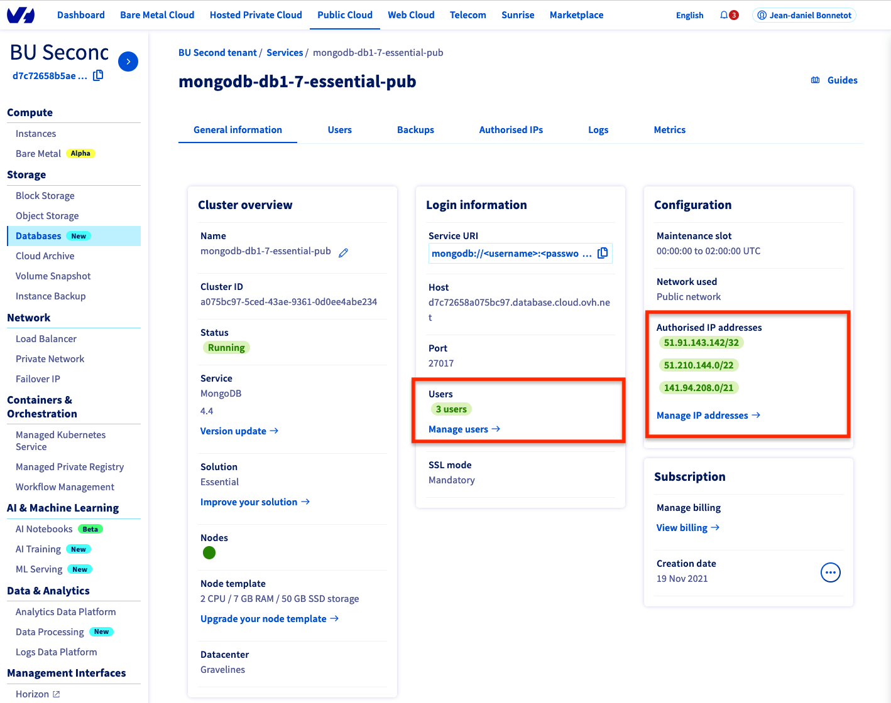

# demo-modernize-nodejs

This is the "new" version of this application. By "new", I mean this application is going to move from a [standalone deployment](https://github.com/pilgrimstack/demo-modernize-nodejs/tree/old) to a scalable architecture using cloud services at OVHcloud.

# Create a Managed Database

We'll log in to the OVHcloud web console, go to "Public Cloud" and create a database. Then we'll add a user and allow IPs.



# Create a public container on OVHcloud Object Storage

## Configure an S3 access at OVHcloud

Follow [this tutorial](https://docs.ovh.com/gb/en/storage/getting_started_with_the_swift_S3_API/) in order to setup an S3 access to our Object Storage service.

## Create a public "bucket"

We'll check our S3 credentials are working at OVHcloud by creating our bucket and open read access publicaly.

```bash
aws --profile default s3 mb s3://demo-scale
aws s3api put-bucket-acl --bucket demo-scale --acl public-read
```

# Deploy instances 

The next action is to use the deployment scripts.

## Get the automation scripts

```bash
cd ~
git clone git@github.com:pilgrimstack/demo-modernize-nodejs.git
cd demo-modernize-nodejs
git checkout new
cd deploy
```
## Configure the environement

We'll copy and edit the env file to .env-new

```
# For config/database.js
DATABASE_CONNECTOR=''
DATABASE_HOST=
DATABASE_PORT=
DATABASE_NAME=''
DATABASE_USERNAME=''
DATABASE_PASSWORD=''
DATABASE_SSL=''
# For config/server.js
ADMIN_JWT_SECRET=''
HOST='0.0.0.0'
PORT=1337
STRAPI_URL=''
# For config/plugins.js
AWS_ACCESS_KEY_ID=''
AWS_ACCESS_SECRET=''
AWS_REGION=''
AWS_BUCKET=''
CDN_DOMAIN=''
CUSTOM_S3_ENDPOINT=''
ACCESS_LEVEL='public-read
```

Where:
* AWS_* are the aws credentials we created before
* CDN_DOMAIN is the object storage container address (not the S3 one), should be somehting like 'https://storage.yourregion.cloud.ovh.net/v1/AUTH_xxxxx/demo-scale'
* CUSTOM_S3_ENDPOINT is the S3 API endpoint 'https://s3.yourregion.cloud.ovh.net'

## Run the automated deployment

```bash
./start.sh
openstack server list
```

# Check the result

Now, if you configured properly your DNS zone, go to http://yourdomain/api/ to populate the posts and to 'http://yourdomain' to get the result.
