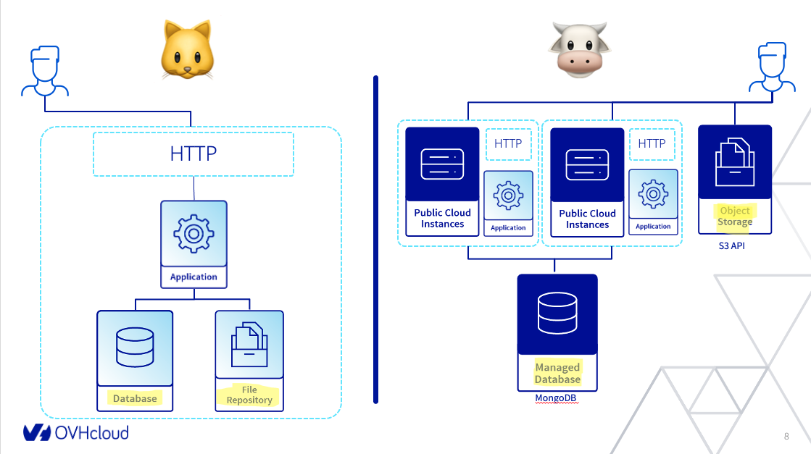

# demo-modernize-backend

There is no code here :) The code is placed on two different branches called 'old' and 'new'.

This application is a strapi deployment managing just blog posts. The goal here is to show the differences between :

* [old branch](https://github.com/pilgrimstack/demo-modernize-nodejs/tree/old): a standalone deployment, everything is on one host
* [new branch](https://github.com/pilgrimstack/demo-modernize-nodejs/tree/new): a scallable deployment, using OVHcloud services like a managed database and an object storage service combined with stateless instances.

It's the classic pets vs cattle approach shown with a real demo. We'll export the the statefull components to managed services and we'll scalle horizontally our stateless instances.

